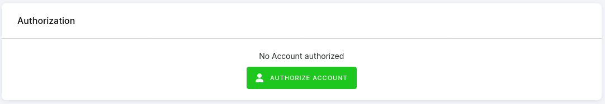

# Google Campaign Manager 360 Extractor

[Google Campaign Manager 360](https://support.google.com/campaignmanager/answer/2709362?hl=en) orchestrates digital advertising campaigns, enabling precise ad placements across multiple
channels. 

This connector enables retrieval of Campaign Manager 360 reports **across multiple Ad Accounts**. It allows you to run CM360 reports in several modes:

1. Define custom report directly in the UI.
2. Select multiple reports with the same structure across multiple accounts.
3. Select one existing report definition that is used as a template and run across multiple selected accounts.


**Table of contents:**

[TOC]


## Prerequisites

1. Get access to [https://support.google.com/campaignmanager?sjid=16894252783161215189-EU#topic=2758513) account.

2. Log into your account using the Authorize Account button in the Keboola interface. 



## Functionality & Configuration

The connector supports three modes:

1. Using existing report definition as a template and executing it across selected accounts.
   - This option is extremely useful if you need to define complex report in the [CM360 Report Builder](https://www.google.com/analytics/dfa/) and use it across multiple accounts. 
   - The selected report is left untouched, and it's copy is created in all selected accounts. The resulting reports are linked to the configuration. The naming convention of the created report is: `keboola_generated_{PROJECT_ID}_{CONFIG_ID}_{ROWID}`
2. Running and downloading existing report definitions. Such report may be defined using the [CM360 Report Builder](https://support.google.com/campaignmanager/answer/2823849?sjid=16894252783161215189-EU&visit_id=638403222303021904-3691116343&rd=1)
   - This option is suitable when you already have multiple same reports defined across required Ad Accounts.
2. Defining report definition directly in the UI.
   - This allows you to define simple report definition directly in the configuration UI.
   - This mode will automatically create an Offline report in the [CM360 Report Builder](https://www.google.com/analytics/dfa/), that will be linked to the configuration. The naming convention of the created report is: `keboola_generated_{PROJECT_ID}_{CONFIG_ID}_{ROWID}`

### Creating and running reports from an existing report definition (template)

- This option is extremely useful if you need to define complex report in the [CM360 Report Builder](https://www.google.com/analytics/dfa/) and use it across multiple accounts. 
- The selected report is left untouched, and it's copy is created in all selected accounts. The resulting reports are linked to the configuration. The naming convention of the created report is: `keboola_generated_{PROJECT_ID}_{CONFIG_ID}_{ROWID}
- All results are downloaded into a single table.


1. Define your report in the [CM360 Report Builder](https://www.google.com/analytics/dfa/). See the official [docs](https://support.google.com/campaignmanager/answer/2823849?sjid=16894252783161215189-EU&visit_id=638403222303021904-3691116343&rd=1).
2. Select the `Report template` in the `Report definition mode` configuration option.
3. Select the existing report from the dropdown of available reports. This report will be then used as a template and recreated across selected accounts.
4. Select the desired `Time Range`
   - You may select either predefined period or a `Custom Date Range`
   - This option allows you to define a relative report period range.
5. Define the **Destination** parameters to control how the result is stored. See the `Destination` section.


### Running existing reports

This option is suitable when you already have multiple same reports defined across required Ad Accounts.

1. Define your report in the [CM360 Report Builder](https://www.google.com/analytics/dfa/). See the official [docs](https://support.google.com/campaignmanager/answer/2823849?sjid=16894252783161215189-EU&visit_id=638403222303021904-3691116343&rd=1).
2. Select the `Existing report ID(s)` in the `Report definition mode` configuration option.
   - **WARNING** the selected reports must have same structure and definition, otherwise the extraction will fail.
3. Select the existing report ID from the dropdown of available reports.
4. The time range is in this case defined by the source report. This is to keep the source reports untouched, since they are not controlled by the component.
5. Define the **Destination** parameters to control how the result is stored. See the `Destination` section.

### Defining report directly in the UI.

1. Select the `Report specification` in the `Report definition mode` configuration option.
2. Define your report in  `Report Details`
   1. Select the `Report Type`
   2. Select desired dimensions
   3. Select the desired metrics.
   4. Optionally, specify filters.
3. Select the desired `Time Range`
   - You may select either predefined period or a `Custom Date Range`
   - This option allows you to define a relative report period range.
4. Define the **Destination** parameters to control how the result is stored. See the `Destination` section.


### Destination - report output

This section defines how the extracted data will be saved in the Keboola Storage. The resulting table always contains `Profile ID` and `Profile Name` columns because the component runs through multiple accounts.

- **Load Type** – If `Full Load` is used, the destination table will be overwritten every run. If `Incremental Load` is used, data will be “upserted” into the destination table.
- **Storage Table Name** – Name of the resulting table stored in Storage.
- **Primary Key** - Since the reports are always custom defined, you need to define what dimensions (columns) represent the unique primary key. This is then used to perform "upserts".
  - Note that if the primary key is not defined properly, you may lose some data during deduplication. If there is no primary key defined and `Incremental Load` mode is used, each execution will lead to a new set of records.
  - **NOTE** If this field is not empty, `Profile ID` and `Profile Name` are always used as primary key because the component runs through multiple accounts.


## Features

| **Feature**             | **Note**                                      |
|-------------------------|-----------------------------------------------|
| Generic UI form         | Dynamic UI form                               |
| Row Based configuration | Allows structuring the configuration in rows. |
| oAuth                   | oAuth authentication enabled                  |
| Incremental loading     | Allows fetching data in new increments.       |
| Dimension filter        | Fetch data of certain dimension values only.  |
| Date range filter       | Specify date range.                           |


## Sample Raw Configuration

### existing report ids

```json
{
    "parameters": {
    "debug": false,
    "profiles": [
      "8467304",
      "8653652"
    ],
    "time_range": {
      "period": "LAST_7_DAYS"
    },
    "destination": {
      "table_name": "vystup",
      "selected_variant": "existing_report_ids",
      "incremental_loading": true,
      "primary_key_existing": []
    },
    "input_variant": "existing_report_ids",
    "existing_report_ids": [
      "1079840351"
    ]
  }
}
```


### template report

```json
{
  "parameters": {
    "debug": true,
    "profiles": [
      "8653652",
      "8467304"
    ],
    "time_range": {
      "period": "LAST_7_DAYS"
    },
    "destination": {
      "table_name": "templated",
      "selected_variant": "report_template_id",
      "incremental_loading": true,
      "primary_key_existing": [
        "activity",
        "country",
        "environment"
      ]
    },
    "input_variant": "report_template_id",
    "report_template_id": "8653652:1096894707"
  }
}
```

### Report specification

```json
{
  "parameters": {
    "debug": true,
    "profiles": [
      "8467304",
      "8653652"
    ],
    "time_range": {
      "period": "CUSTOM_DATES",
      "date_to": "today",
      "date_from": "today - 4"
    },
    "destination": {
      "table_name": "vystup",
      "primary_key": [
        "activityId",
        "campaignId"
      ],
      "selected_variant": "report_specification",
      "incremental_loading": true
    },
    "input_variant": "report_specification",
    "report_specification": {
      "metrics": [
        "clicks",
        "costPerClick"
      ],
      "dimensions": [
        "activityId",
        "campaignId"
      ],
      "report_type": "STANDARD"
    }
  }
}
```


Development
-----------

If required, change local data folder (the `CUSTOM_FOLDER` placeholder) path to your custom path in
the `docker-compose.yml` file:

~~~~~~~~~~~~~~~~~~~~~~~~~~~~~~~~~~~~~~~~~~~~~~~~~~~~~~~~~~~~~~~~~~~~~~~~~~~~~~~~
    volumes:
      - ./:/code
      - ./CUSTOM_FOLDER:/data
~~~~~~~~~~~~~~~~~~~~~~~~~~~~~~~~~~~~~~~~~~~~~~~~~~~~~~~~~~~~~~~~~~~~~~~~~~~~~~~~

Clone this repository, init the workspace and run the component with following command:

~~~~~~~~~~~~~~~~~~~~~~~~~~~~~~~~~~~~~~~~~~~~~~~~~~~~~~~~~~~~~~~~~~~~~~~~~~~~~~~~
docker-compose build
docker-compose run --rm dev
~~~~~~~~~~~~~~~~~~~~~~~~~~~~~~~~~~~~~~~~~~~~~~~~~~~~~~~~~~~~~~~~~~~~~~~~~~~~~~~~

Run the test suite and lint check using this command:

~~~~~~~~~~~~~~~~~~~~~~~~~~~~~~~~~~~~~~~~~~~~~~~~~~~~~~~~~~~~~~~~~~~~~~~~~~~~~~~~
docker-compose run --rm test
~~~~~~~~~~~~~~~~~~~~~~~~~~~~~~~~~~~~~~~~~~~~~~~~~~~~~~~~~~~~~~~~~~~~~~~~~~~~~~~~

Integration
===========

For information about deployment and integration with KBC, please refer to the
[deployment section of developers documentation](https://developers.keboola.com/extend/component/deployment/)